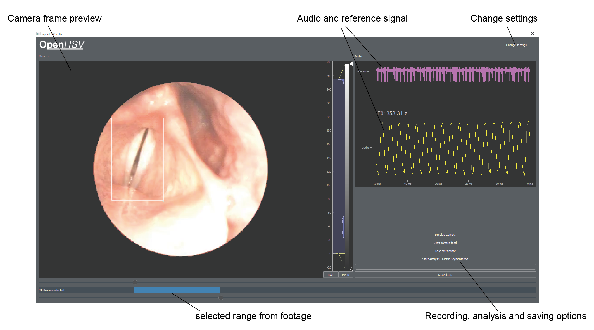

.. OpenHSV documentation master file, created by
   sphinx-quickstart on Thu Apr 16 16:32:32 2020.
   You can adapt this file completely to your liking, but it should at least
   contain the root `toctree` directive.

Welcome to OpenHSV's documentation!
===================================

OpenHSV is an open platform for laryngeal high-speed videoendoscopy. This documentation will help you 
to setup OpenHSV and to do data analysis.

.. note::
   OpenHSV is only a **research** tool and is **not FDA approved**. You may consult your local ethics committee
   before using OpenHSV in your environment/clinic. 

.. toctree::
    :maxdepth: 2
    :caption: User Guide
    :glob:

    userguide/*

.. toctree::
    :maxdepth: 2
    :caption: Developer Guide
    :glob:

    modules/*
