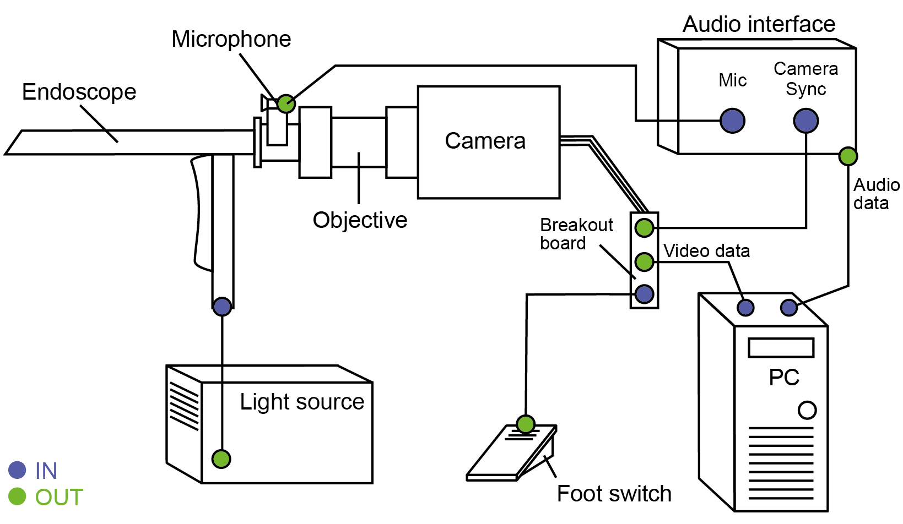

.. _hardware: 

Hardware setup
==============

The OpenHSV system consists of an **audio**, **video**, **illumination** and **acquisition** module.

.. role:: python(code)
    :language: python

Audio 
-----

The audio signal is acquired using a high-quality lavalier microphone, e.g. DPA 4060. This is connected
to a conventional USB-powered two-channel audio interface. Two channels, because we need one channel for
the microphone and one for the camera synch. The microphone is mounted on a custom 3D-printed clamp that
is mounted on the endoscope.

Video
-----

Follow these steps:

    #. Mount objective/video coupler to camera 
    #. Connect video coupler to endoscope
    #. Connect light guide to endoscope
    #. Mount microphone mount on endoscope
    #. Connect camera to breakout board 
    #. Connect microphone to audio interface
    #. Connect camera synch out to audio interface (you may need a BNC -> TSSR adapter_)
    #. Connect camera to computer (patch cable)

You can start and stop the acquisition using the OpenHSV software; however, stopping the acquisition using
a foot switch is better suited in an examination setting. For that, connect a foot switch to the TRIG IN port. 
Ensure that the foot switch has a BNC connector.

.. note::

    Foot switch may come with loose ends. 
    This may need some additional tinkering, such as soldering a BNC connector to the cable. 
    As replacement, you may also use a `screw-type BNC connector`_.

Illumination
------------

For high-speed videoendoscopy, a powerful illumination unit, such as STORZ TL 300, is unevitable. 
Connect the power cable and the light guide accordingly. You may need 100% of light output, depending
on your video coupler and recording sampling rate. 

Acquisition
-----------

We use a conventional personal computer (PC) installed with Windows 10. Depending on your PC, 
you may add another Gigabit Ethernet adapter to have both, network access and camera data transfer.
With IDT cameras, the Ethernet adapter needs to have a similar IP address. Check with the camera's IP address
and change it accordingly for your case. E.g. the camera has 100.0.0.100, then you may use 100.0.0.99 on your PC.

.. _adapter: https://www.perakabel.de/bnc-stecker-auf-klinkenstecker-6-3mm-mono-kabel-50-ohm.html 
.. _`screw-type BNC connector`: https://www.reichelt.de/terminal-block-2-pin-bnc-stecker-goobay-76738-p212970.html