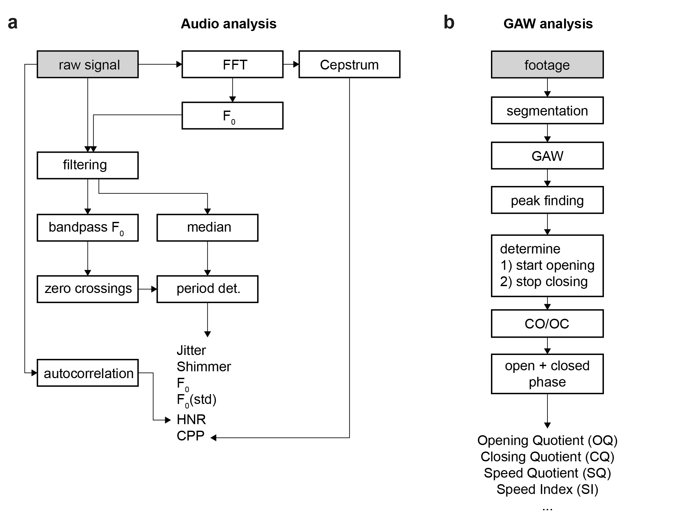

.. _`Data Analysis`: 

Data Analysis
=============

Data analysis is performed for audio (a) and video (b) data and follows different paths:

Audio analysis
--------------

Audio data is cropped to the last 4 seconds (arbitrary, can be changed). The landmarks for acquisition
and synchronization are detected using several peak finding algorithms (see code). The audio data that
corresponds to the video data is subsequently analyzed (*raw signal* in above Figure, panel a). 

Quantitative parameters are computed on the signal. Currently, these are:

    * mean-jitter
    * jitter-percent
    * mean-shimmer
    * shimmer-percent
    * fundamental frequency (F0) and standard deviation (STD)
    * Harmonics-to-Noise-Ratio (HNR)
    * Cepstral Peak Prominence (CPP)
    
Video analysis
--------------

The glottal area is segmented using a deep convolutional neural network that was trained on the `BAGLS https://www.bagls.org/` dataset.
Next, we use the segmented glottal area to

    * compute the glottal area waveform (GAW)
    * estimate the glottal midline to
        * compute GAW for left and right vocal fold
        * compute phonovibrogram (PVG)

With that, we follow the analysis pipeline as shown in the above Figure, panel b,
to finally compute quantitative parameters. Currently, these are:

    * Opening Quotient (OQ)
    * Closing Quotient (CQ)
    * Asymmetry Quotient (AQ)
    * Rate Quotient (RQ)
    * Speed Quotient (SQ)
    * Speed Index (SI)
    * Fundamental frequency (F0)
    * Amplitude perturbation factor (APF)
    * Amplitude perturbation quotient (APQ)
    * Glottis gap index (GGI)
    * Amplitude Quotient (AQ)
    * Stiffness
    * Amplitude Symmetry Index (ASI)
    * Phase Asymmetry Index (PAI)

Analysis
--------

Parameters are shown in a separate window using a tabular view. All computed parameters can be exported as CSV file.