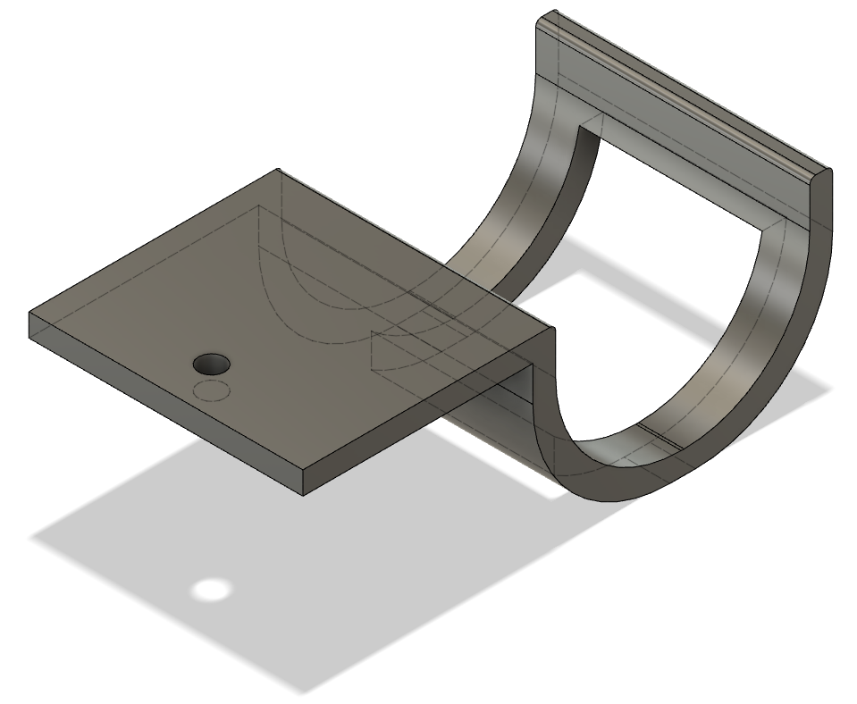
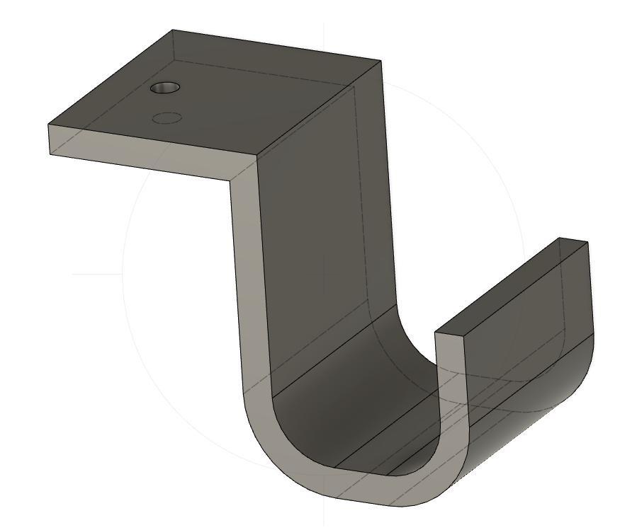
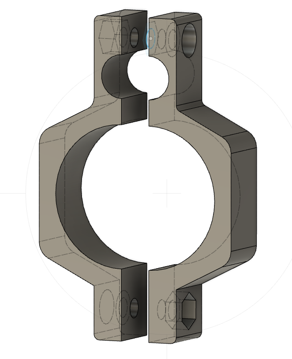
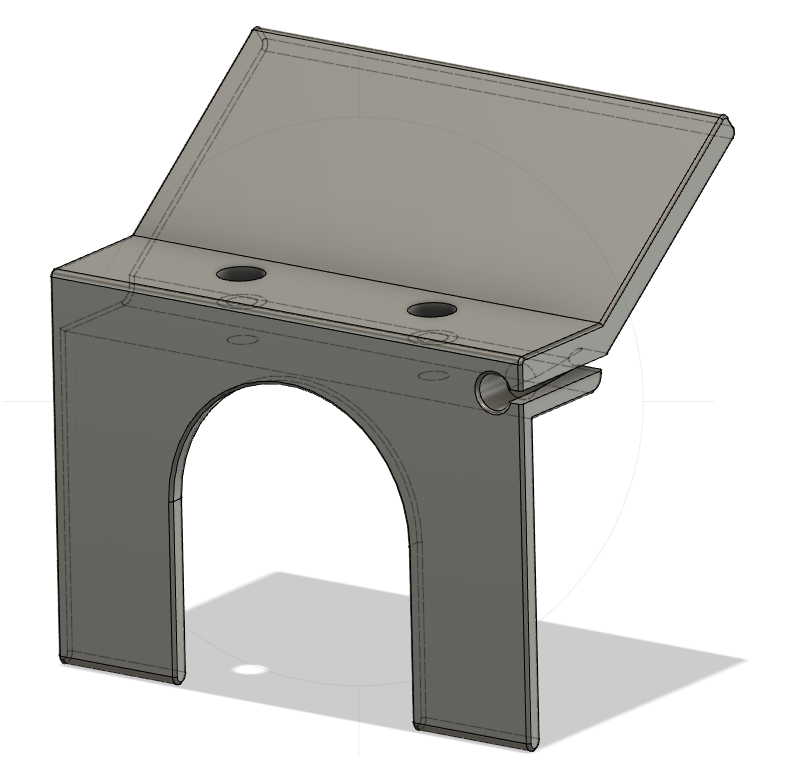

3D printed parts
================

We 3D-printed the following parts to fit our needs. Everything was printed in Prusa PLA 
using the `Prusa Mini FDM 3D-printer <https://www.prusa3d.de/original-prusa-mini/>`_. We use typically an infill of 15% and 200 um layer size.
All parts were designed in Fusion 360.

Endoscope holder
----------------

Endoscope holder to store the imaging unit.

Cable holder
----------------

Cable holder for light guide and other cables.

Microphone mount
----------------

The microphone mount consists of two parts: 
Part1_ and Part2_. You further need M3 screws and nuts
to assemble it. Depending on your endoscope and the examiner
this mount may cause some discomfort in handling the imaging unit.

Droplet protection shield
-------------------------

Also known as *Corona shield*. It is mounted with M4 screws on the IDT
camera to protect the camera. On the side we provide an integrated microphone 
mount. The microphone cable enters on the side and is then pushed inwards.

.. _Part1: ../../../../stl/Mic_clamp_1.stl
.. _Part2: ../../../../stl/Mic_clamp_2.stl
